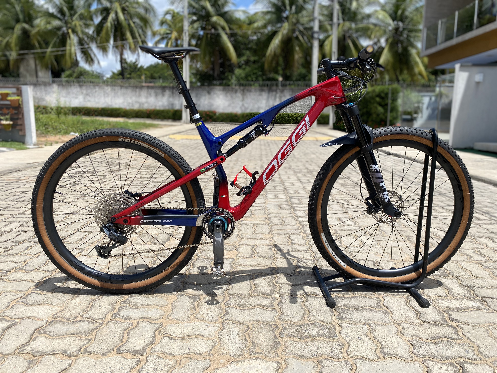

<h1 align="center"> PERFIL PAULO BRAGA </h1>

Meu Primeiro projeto usando um repositório no GITHUB.

 

  

## 🚀 Tecnologias

Esse projeto foi desenvolvido com as seguintes tecnologias:

- HTML e CSS
- JavaScript
- Git e Github

## 💻 Projeto

MOSTRAR UM POUCO DAS MINHAS HABILIDADES COMO PROGRAMADOR
